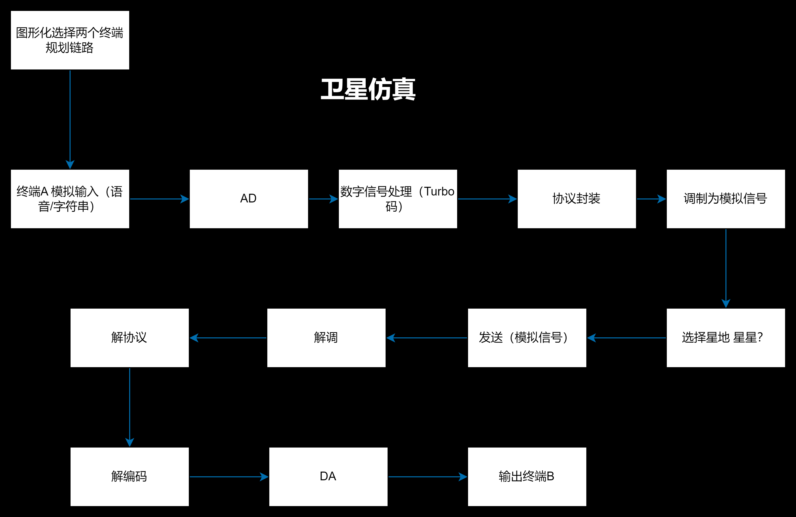

# 简化卫星移动通信仿真系统实验功能报告

## 1. 实验目标

本实验旨在模拟卫星移动通信系统中终端间的通信流程，研究信号的采集、处理、传输及接收的完整过程。通过该仿真实验，我们希望达到以下目标：
- **掌握信号采集、编码、调制、协议封装等发送端信号处理流程**，理解这些步骤如何影响通信的质量和效率。
- **理解卫星信号转发的基本原理及其对通信链路的影响**，包括信号的衰减、传播延迟和噪声干扰等因素。
- **熟悉接收端解调、解码、协议解析及信号恢复的过程**，确保数据能够完整无误地传输。
- **通过仿真系统分析不同调制、编码方案对通信质量的影响**，优化系统设计，提高抗干扰能力和数据传输效率。

## 2. 实验环境与工具

### 硬件设备
- 计算机工作站

### 软件工具
- NS3（网络仿真器）
- GNU Radio
- Wireshark（协议分析）
- **Python + PyQt**（用于仿真系统GUI设计）

## 3. 逻辑设计

### 3.1 发送端（终端A）

1. **信号采集**
   - 终端A通过传感器或麦克风采集待发送的模拟信号，如语音或数据流。
   - 采用预处理技术，如滤波和降噪，提高信号质量。

2. **模数转换（AD转换）**
   - 采用合适的采样率（如8kHz、44.1kHz）对模拟信号进行采样，并使用量化算法将其转换为数字信号。
   - 通过实验分析不同采样率和量化位数对信号质量的影响。

3. **数字信号编码**
   - 采用信道编码技术（如Turbo码、卷积码）对信号进行编码，提高数据传输的抗干扰能力。
   - 研究编码增益和误码率的关系，优化编码方案。

4. **协议封装**
   - 采用特定协议对数据进行封装，添加源地址、目标地址、时间戳、校验码等信息。
   - 研究不同封装格式对数据传输效率的影响。

5. **信号调制**
   - 采用BPSK、QPSK或更复杂的调制方式（如16QAM）将数字信号转换为无线电波。
   - 通过仿真软件观察调制信号的频谱和时域波形。

6. **信号发送**
   - 通过上行链路将信号发送至卫星，研究不同天线参数对信号传输的影响。

### 3.2 卫星转发

1. **信号接收**
   - 采用卫星仿真模型接收终端A的信号，并进行放大、滤波等处理。

2. **信号转发**
   - 研究卫星对信号的中继转发特性，包括信号衰减、传播延迟、多普勒效应等。

### 3.3 接收端（终端B）

1. **信号接收**
   - 通过下行链路接收卫星转发的信号，并分析接收信号的信噪比（SNR）。

2. **信号解调**
   - 使用匹配滤波器和相干解调技术，恢复数字信号，并分析误码率。

3. **协议解析**
   - 解析数据包，提取源地址、目标地址等信息，验证数据完整性。

4. **数字信号解码**
   - 采用纠错解码技术恢复原始数据，并分析解码前后误码率的变化。

5. **数模转换（DA转换）**
   - 采用DAC（数字-模拟转换器）将数字信号恢复为模拟信号，并分析恢复信号的保真度。

## 4.流程图

## 5. PyQt GUI 设计与实现

1. **GUI 主要功能**
   - 提供可视化的终端A、卫星转发、终端B的工作流程。
   - 实时显示信号波形、误码率分析。
   - 允许用户自定义调制方式、信道条件等。

2. **可扩展性**
   - 进一步完善GUI，加入实时信号显示（如Matplotlib嵌入）。
   - 连接仿真模块，实现完整的数据流动。

## 6. 可能遇到的问题及解决方案

1. **信号衰落问题**：采用均衡技术提高接收信号质量。
2. **误码率较高**：优化编码方式，如LDPC编码。
3. **多普勒效应影响**：采用自适应调制技术进行补偿。
4. **GUI 响应速度慢**：采用多线程优化PyQt响应速度。

## 7. 结论与改进方向

1. **优化编码调制方案**
   - 采用联合编码调制技术提高系统的抗干扰能力。

2. **引入MIMO技术**
   - 采用多输入多输出（MIMO）技术，提高系统容量。

3. **优化信道建模**
   - 引入更真实的卫星信道模型，提高仿真精度。

## 8. 参考文献
[1] Proakis, J. G. Digital Communications. McGraw-Hill, 2008.  
[2] Sklar, B. Digital Communications: Fundamentals and Applications. Prentice Hall, 2001.
