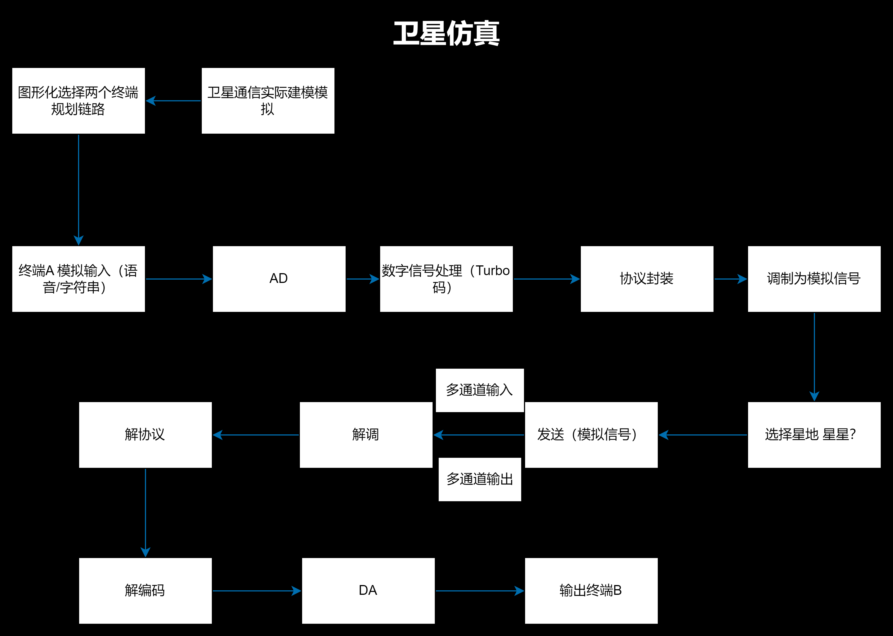
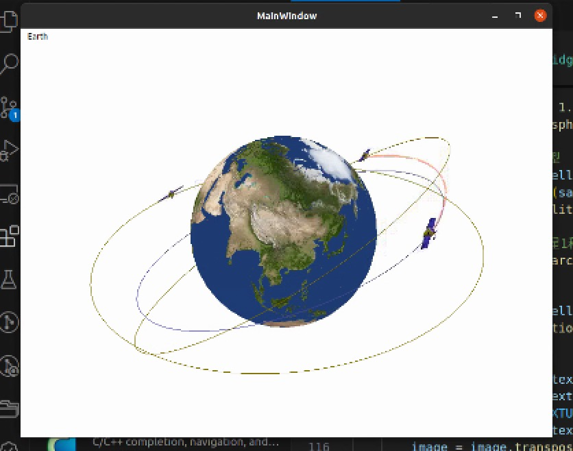

# 简化卫星移动通信仿真系统实验功能报告

## 1. 实验目标

本实验旨在模拟卫星移动通信系统中终端间的通信流程，研究信号的采集、处理、传输及接收的完整过程。通过该仿真实验，我们希望达到以下目标：
- **掌握信号采集、编码、调制、协议封装等发送端信号处理流程**，理解这些步骤如何影响通信的质量和效率。
- **理解卫星信号转发的基本原理及其对通信链路的影响**，包括信号的衰减、传播延迟和噪声干扰等因素。
- **熟悉接收端解调、解码、协议解析及信号恢复的过程**，确保数据能够完整无误地传输。
- **通过仿真系统分析不同调制、编码方案对通信质量的影响**，优化系统设计，提高抗干扰能力和数据传输效率。

## 2. 实验环境与工具

### 硬件设备
- 计算机工作站

### 软件工具
- NS3（网络仿真器）

- Wireshark（协议分析）
- **Python + PyQt**（用于仿真系统GUI设计）

## 3. 逻辑设计

### 3.1 发送端（终端A）

1. **信号采集**
   - 终端A通过传感器或麦克风采集待发送的模拟信号，如语音或数据流。
   - 采用预处理技术，如滤波和降噪，提高信号质量。

2. **模数转换（AD转换）**
   - 采用合适的采样率（如8kHz、44.1kHz）对模拟信号进行采样，并使用量化算法将其转换为数字信号。
   - 通过实验分析不同采样率和量化位数对信号质量的影响。

3. **数字信号编码**
   - 采用信道编码技术（如Turbo码、卷积码）对信号进行编码，提高数据传输的抗干扰能力。
   - 研究编码增益和误码率的关系，优化编码方案。

4. **协议封装**
   - 采用特定协议对数据进行封装，添加源地址、目标地址、时间戳、校验码等信息。
   - 研究不同封装格式对数据传输效率的影响。

5. **信号调制**
   - 采用BPSK、QPSK或更复杂的调制方式（如16QAM）将数字信号转换为无线电波。
   - 通过仿真软件观察调制信号的频谱和时域波形。

6. **信号发送**
   - 通过上行链路将信号发送至卫星，研究不同天线参数对信号传输的影响。

### 3.2 卫星转发

1. **信号接收**
   - 采用卫星仿真模型接收终端A的信号，并进行放大、滤波等处理。

2. **信号转发**
   - 研究卫星对信号的中继转发特性，包括信号衰减、传播延迟、多普勒效应等。

### 3.3 接收端（终端B）

1. **信号接收**
   - 通过下行链路接收卫星转发的信号，并分析接收信号的信噪比（SNR）。

2. **信号解调**
   - 使用匹配滤波器和相干解调技术，恢复数字信号，并分析误码率。

3. **协议解析**
   - 解析数据包，提取源地址、目标地址等信息，验证数据完整性。

4. **数字信号解码**
   - 采用纠错解码技术恢复原始数据，并分析解码前后误码率的变化。

5. **数模转换（DA转换）**
   - 采用DAC（数字-模拟转换器）将数字信号恢复为模拟信号，并分析恢复信号的保真度。

## 4.流程图

## 5. PyQt GUI 设计与实现

1. **GUI 主要功能**
   - 提供可视化的终端A、卫星转发、终端B的工作流程。
   - 实时显示信号波形、误码率分析。
   - 允许用户自定义调制方式、信道条件等。

2. **可扩展性**
   - 进一步完善GUI，加入实时信号显示（如OpenGl嵌入）。
   - 连接仿真模块，实现完整的数据流动。
3. 结果展示与数据可视化
    - **误码率与信噪比关系图**：绘制不同天线配置下的误码率（BER）曲线，展示随着信噪比（SNR）变化的系统性能。
    - **系统容量分析图**：展示不同用户数量下，系统容量如何变化，能够直观地展示系统的容量扩展性。
    - **动态链路可视化**：通过图表和动画形式，展示卫星轨道与地面站的动态调整过程、链路质量等信息。
    - **GUI界面优化**：进一步完善PyQt的用户界面，使其支持实时数据图表显示与交互操作，让用户更直观地进行仿真和结果分析。
## 6.1 多输入多输出（MIMO）技术简介与意义

在现代无线通信系统中，为了进一步提升数据传输速率和系统容量，引入了多输入多输出（MIMO, Multiple-Input Multiple-Output）技术。MIMO 通过在发送端和接收端配置多个天线，实现信道的空间复用和空间分集。

### 6.1.1 MIMO 的基本原理

MIMO 技术通过多个发射天线同时发送不同的数据流，并利用多个接收天线接收信号，在相同频率资源下实现更高的数据吞吐量。

设发送端有 $N_t$ 个天线，接收端有 $N_r$ 个天线，系统模型可描述为：

$$
\mathbf{y} = \mathbf{H} \mathbf{x} + \mathbf{n}
$$

- $\mathbf{y}$：接收信号向量（$N_r \times 1$）
- $\mathbf{H}$：信道矩阵（$N_r \times N_t$）
- $\mathbf{x}$：发送信号向量（$N_t \times 1$）
- $\mathbf{n}$：接收噪声（$N_r \times 1$）

### 6.1.2 MIMO 的优势

- **系统容量提升**：MIMO 能够在同一带宽和功率下成倍提高通信速率。
- **抗多径衰落能力增强**：通过空间分集获得更鲁棒的链路。
- **频谱效率提升**：频谱利用率显著高于传统单天线系统。
- ### 6.2 GUI 控件设计

在 PyQt GUI 中设计以下功能控件：

- **天线配置选择框**：
  - 下拉菜单供用户选择天线数量（1x1、2x2、4x4）。
- **SNR 调节滑块**：
  - 用于设置仿真中的信噪比（Signal-to-Noise Ratio）。
- **解码算法切换选项**：
  - 单选按钮用于切换解码方式：ZF（零强迫）或 MMSE（最小均方误差）。
- **误码率曲线显示区**：
  - 实时绘制 BER（Bit Error Rate）随 SNR 和天线数量变化的曲线。

# 7. 卫星通信在实际环境中的建模

将实验从理论模型拓展到实际应用时，考虑卫星轨道仿真和地面站的动态调整至关重要。不同轨道类型（低轨卫星LEO、中轨卫星MEO和静止轨道卫星GEO）具有不同的通信特点，下面将介绍如何在仿真中加入这些因素。

## 1. 卫星轨道的分类与特点

### 1.1 低轨卫星（LEO）
- **高度**：500 km - 2000 km
- **特点**：低延迟（30-50毫秒），覆盖范围小，需部署大量卫星，易受大气干扰。

### 1.2 中轨卫星（MEO）
- **高度**：5000 km - 20000 km
- **特点**：适中延迟（<150毫秒），覆盖范围广，适合中继和数据传输。

### 1.3 静止轨道卫星（GEO）
- **高度**：35786 km
- **特点**：较高延迟（>240毫秒），固定视场，覆盖大区域，适用于全球通信。

## 2. 卫星轨道仿真

### 2.1 轨道仿真步骤
1. **选择轨道类型**：基于卫星类型选择合适轨道高度。
2. **计算轨道周期**：使用开普勒定律计算卫星运动轨迹。
3. **卫星位置与地面站**：动态计算卫星与地面站之间的相对位置。
4. **视距与信号链路**：计算卫星与地面站的信号传输路径和衰减。

### 2.2 动态调整与切换
- **低轨卫星的跟踪**：地面站需快速调整天线方向，确保始终对准卫星。
- **卫星切换**：当低轨卫星离开视野时，自动切换至其他卫星，确保通信链路持续稳定。

## 3. 卫星地面站的动态调整

### 3.1 动态天线跟踪
- 通过自动天线跟踪系统调整天线方向，确保与卫星对准。
- 使用电子扫描阵列（ESA）技术提高天线跟踪精度。

### 3.2 卫星地面站调度
- **低轨卫星**：快速切换至新卫星以确保通信不中断。
- **静止轨道卫星**：地面站通信链路稳定，适合提供长期稳定的服务。

## 4. 实验中的应用
- **信号衰减与延迟**：模拟不同轨道卫星通信链路的信号衰减、延迟等影响。
- **多普勒效应**：考虑低轨卫星的多普勒效应对信号频率的影响。
- **误码率（BER）**：分析不同轨道卫星下的误码率变化，优化通信系统设计。

通过这些优化，可以更真实地模拟卫星通信的实际场景，提高系统的可靠性和效率。

## 8. 可能遇到的问题及解决方案

1. **信号衰落问题**：采用均衡技术提高接收信号质量。
2. **误码率较高**：优化编码方式，如LDPC编码。
3. **多普勒效应影响**：采用自适应调制技术进行补偿。
4. **GUI 响应速度慢**：采用多线程优化PyQt响应速度。

## 9. 结论与改进方向

1. **优化编码调制方案**
   - 采用联合编码调制技术提高系统的抗干扰能力。

2. **优化信道建模**
   - 引入更真实的卫星信道模型，提高仿真精度。

## 8. 参考文献
[1] Proakis, J. G. Digital Communications. McGraw-Hill, 2008.  
[2] Sklar, B. Digital Communications: Fundamentals and Applications. Prentice Hall, 2001.
